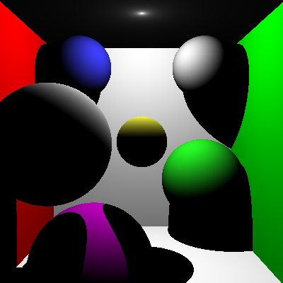
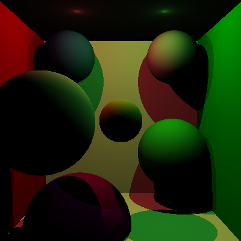
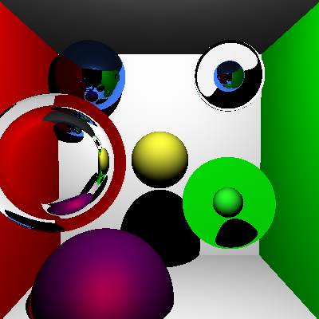
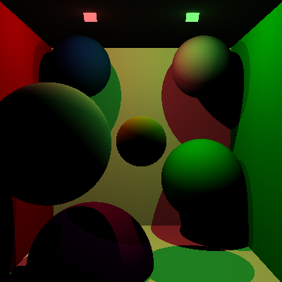
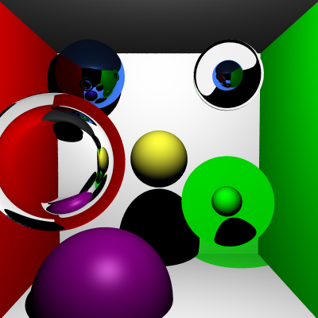

Ray Tracer Part II
======================

**University of Pennsylvania, CIS 561: Advanced Computer Graphics, Homework 2**

Seyoung An's Results
------------

Overview
------------
You will extend the ray tracer engine you have made thus far to perform basic
ray tracing operations, including the computation of specular ray reflections
and specular ray refractions.

`Light` and `PointLight` Classes (20 points)
-------------
Write a general `Light` class to represent light sources, and have `PointLight`
inherit from it. Next week we will add area lights in addition to point lights.
Your `Light` class should have the following members:
* A `Color3f` representing the light's hue and intensity. This means the color
values may be greater than 1 if the light is brighter.
* A function that, given an `Intersection` in the scene, determines if that
`Intersection` can see the `Light` (i.e. a shadow test).

`Material` Class (10 points)
-------------
You will write a class that represents a general surface reflection/transmission
model, which will be inherited by several different classes. Your `Material`
class should declare the following members:
* A purely virtual function `GetScatteredColor` to compute the direction(s) from which light should
reach a point of intersection. It should take in an `Intersection` as input, as
well as the `Ray` that caused the `Intersection`. It will return a `Color3f`
which is the multiplication of the light color and `Material` color.
* A `Color3f` member variable that represents the base color of the `Material`.

`Material` Subclasses (60 points)
------------
Create the following classes which inherit from `Material`:
* `LambertMaterial`
* `BlinnPhongMaterial`
* `SpecularReflectionMaterial`
* `SpecularTransmissionMaterial`

As their names imply, these should represent some of the various surface
reflection and transmission functions we discussed in class. Importantly,
they will each implement `GetScatteredColor` differently:
* `LambertMaterial` and `BlinnPhongMaterial` should sample all light sources
in the scene for their color (testing for visibility) and return the sum of
their colors multiplied with the `Material` base color.
* `SpecularReflectionMaterial` should reflect the input `Ray` about the surface
normal and evaluate `GetScatteredColor` at the point where the reflected `Ray`
intersects the scene.
* `SpecularTransmissionMaterial` should refract the input `Ray` through the
surface about the surface normal and evaluate `GetScatteredColor` at the point
where the transmitted ray intersects the scene. Make sure to offset the new
`Ray`'s origin in the correct direction so the `Ray` doesn't infinitely
intersect the object it's trying to pass through.

Putting it all together
----------
Once you have these classes, you can update your image generation function in
`MainWindow` to trace each ray that is cast through the scene and evaluate the
scattered light energy at each point of intersection.

We have provided a few JSON files in the Git repository for this assignment.
You do __not__ need to implement a scene loader, but you should create `Scene`
layouts that match the ones provided in the JSONs so you can test your rendering
engine against the provided example images. One important note: the provided
scene files were designed for last year's iteration of the ray tracer, and do
not explicitly define light sources, but assign emissive `Material`s to objects.
Since we are treating `Light`s a little differently (and only using point
lights this week), just note that the example renders will have visible light
sources that your renders will not have.

`cornell_box.json`

`cornell_box_2lights_simple.json`

`reflection_refraction.json`

Code Style (10 points)
------------
For the ray tracer assignments in this course, we will be grading you on coding
style since you'll be writing nearly all of the code yourself. We will be
following the style guide defined in CIS 560; you can find it [here](https://www.cis.upenn.edu/~cis460/18fa/styleguide.html) if you need to
review it. Part of this style guide is based on the design decisions made in
`Physically Based Rendering`, so adhering to it now will help you to better
understand PBRT's code once we begin the path tracer.

Submitting your project
--------------
Rather than uploading a zip file to Canvas, you will simply submit a link to
the committed version of your code you wish us to grade. If you click on the
__Commits__ tab of your repository on Github, you will be brought to a list of
commits you've made. Simply click on the one you wish for us to grade, then copy
and paste the URL of the page into the Canvas submission form.

At the top of this Markdown file, add a section titled "[Your Full Name Here]'s
Results" and show your test renders there.
